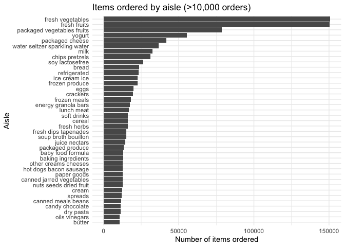
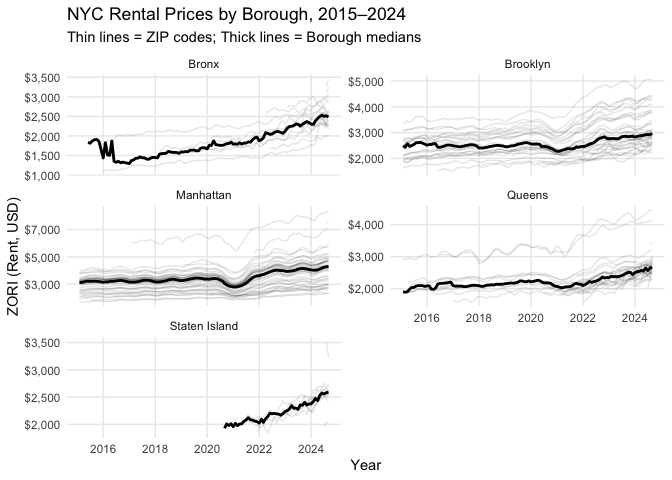
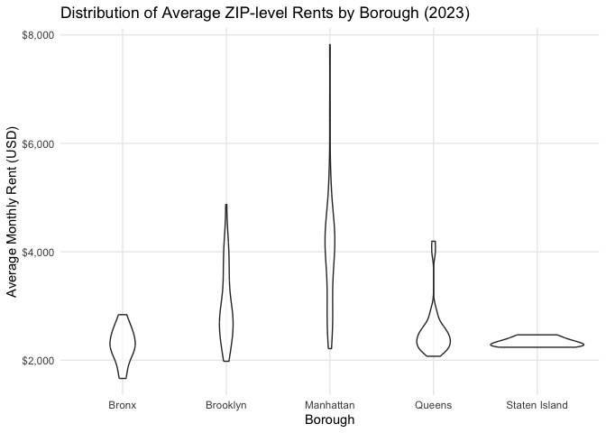
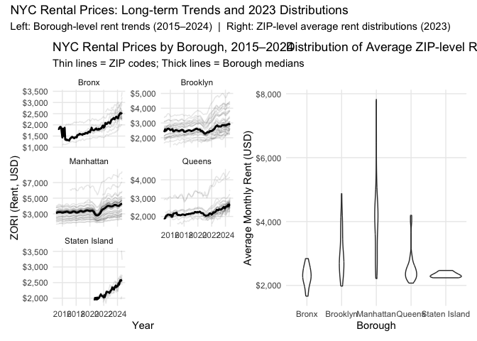

p8105_hw3_zx2527
================
Zihan Xiong
2025-10-11

# Library load

``` r
library(tidyverse)
```

    ## ── Attaching core tidyverse packages ──────────────────────── tidyverse 2.0.0 ──
    ## ✔ dplyr     1.1.4     ✔ readr     2.1.5
    ## ✔ forcats   1.0.0     ✔ stringr   1.5.1
    ## ✔ ggplot2   3.5.2     ✔ tibble    3.3.0
    ## ✔ lubridate 1.9.4     ✔ tidyr     1.3.1
    ## ✔ purrr     1.1.0     
    ## ── Conflicts ────────────────────────────────────────── tidyverse_conflicts() ──
    ## ✖ dplyr::filter() masks stats::filter()
    ## ✖ dplyr::lag()    masks stats::lag()
    ## ℹ Use the conflicted package (<http://conflicted.r-lib.org/>) to force all conflicts to become errors

``` r
library(janitor)
```

    ## 
    ## Attaching package: 'janitor'
    ## 
    ## The following objects are masked from 'package:stats':
    ## 
    ##     chisq.test, fisher.test

``` r
library(p8105.datasets)
library(lubridate)
library(patchwork)
library(scales)
```

    ## 
    ## Attaching package: 'scales'
    ## 
    ## The following object is masked from 'package:purrr':
    ## 
    ##     discard
    ## 
    ## The following object is masked from 'package:readr':
    ## 
    ##     col_factor

# Problem 1

``` r
data("instacart")
glimpse(instacart)
```

    ## Rows: 1,384,617
    ## Columns: 15
    ## $ order_id               <int> 1, 1, 1, 1, 1, 1, 1, 1, 36, 36, 36, 36, 36, 36,…
    ## $ product_id             <int> 49302, 11109, 10246, 49683, 43633, 13176, 47209…
    ## $ add_to_cart_order      <int> 1, 2, 3, 4, 5, 6, 7, 8, 1, 2, 3, 4, 5, 6, 7, 8,…
    ## $ reordered              <int> 1, 1, 0, 0, 1, 0, 0, 1, 0, 1, 0, 1, 1, 1, 1, 1,…
    ## $ user_id                <int> 112108, 112108, 112108, 112108, 112108, 112108,…
    ## $ eval_set               <chr> "train", "train", "train", "train", "train", "t…
    ## $ order_number           <int> 4, 4, 4, 4, 4, 4, 4, 4, 23, 23, 23, 23, 23, 23,…
    ## $ order_dow              <int> 4, 4, 4, 4, 4, 4, 4, 4, 6, 6, 6, 6, 6, 6, 6, 6,…
    ## $ order_hour_of_day      <int> 10, 10, 10, 10, 10, 10, 10, 10, 18, 18, 18, 18,…
    ## $ days_since_prior_order <int> 9, 9, 9, 9, 9, 9, 9, 9, 30, 30, 30, 30, 30, 30,…
    ## $ product_name           <chr> "Bulgarian Yogurt", "Organic 4% Milk Fat Whole …
    ## $ aisle_id               <int> 120, 108, 83, 83, 95, 24, 24, 21, 2, 115, 53, 1…
    ## $ department_id          <int> 16, 16, 4, 4, 15, 4, 4, 16, 16, 7, 16, 4, 16, 2…
    ## $ aisle                  <chr> "yogurt", "other creams cheeses", "fresh vegeta…
    ## $ department             <chr> "dairy eggs", "dairy eggs", "produce", "produce…

**Description of the dataset**

There are 1384617 rows and 15 columns, and each of them represents a
single product added to a user’s grocery order on the Instacart.

Key variables include:

1.  order_id (unique order to help identify)
2.  product_id
3.  add_to_cart_order (order in which each product was added to cart)
4.  reordered (the product has been repurchased by the same customer or
    not)
5.  user_id  
6.  eval_set (which evaluation set this order belongs in)
7.  order_number
8.  order_dow (the day of the week on which the order was placed)
9.  order_hour_of_day (the hour of the day on which the order was
    placed)
10. days_since_prior_order (days since the last order, capped at 30, NA
    if order_number=1)
11. product_name
12. aisle_id (aisle identifier)
13. department_id  
14. aisle
15. department

Description:

For example, in order \#1, user 112108 purchased six items — including
products with IDs 49302 and 11109 — as part of their fourth recorded
order (order_number = 4) on a Thursday (order_dow = 4).

``` r
aisle_counts = instacart |>
  count(aisle) |>
  arrange(desc(n))


n_aisles <- nrow(aisle_counts)
n_aisles
```

    ## [1] 134

``` r
head(aisle_counts, 10)
```

    ## # A tibble: 10 × 2
    ##    aisle                              n
    ##    <chr>                          <int>
    ##  1 fresh vegetables              150609
    ##  2 fresh fruits                  150473
    ##  3 packaged vegetables fruits     78493
    ##  4 yogurt                         55240
    ##  5 packaged cheese                41699
    ##  6 water seltzer sparkling water  36617
    ##  7 milk                           32644
    ##  8 chips pretzels                 31269
    ##  9 soy lactosefree                26240
    ## 10 bread                          23635

Description:

There are **134** aisles and **fresh vegetables (150609 orders) and
fresh fruits (150473 orders)** are the most items ordered from.

**Make a plot on aisles with more than 10000 items**

``` r
instacart |>
  count(aisle) |>
  filter(n > 10000) |>
  mutate(aisle=fct_reorder(aisle,n)) |>
  ggplot(aes(x = aisle, y=n)) +
  geom_col() +
  coord_flip() +
  labs(
    x = "Aisle",
    y = "Number of items ordered",
    title = "Items ordered by aisle (>10,000 orders)"
  ) +
  theme_minimal()
```

<!-- -->

``` r
top3_tbl = instacart |>
  filter(aisle %in% c("baking ingredients", "dog food care", "packaged vegetables fruits")) |>
  group_by(aisle, product_name) |>
  summarize(n = n(), .groups = "drop_last") |>
  arrange(aisle, desc(n)) |>
  mutate(rank_in_aisle = min_rank(desc(n))) |>
  filter(rank_in_aisle <= 3) |>
  arrange(aisle, rank_in_aisle) |>
  select(aisle, product_name, n)

knitr::kable(top3_tbl, digits = 0, col.names = c("Aisle", "Product", "Orders"))
```

| Aisle | Product | Orders |
|:---|:---|---:|
| baking ingredients | Light Brown Sugar | 499 |
| baking ingredients | Pure Baking Soda | 387 |
| baking ingredients | Cane Sugar | 336 |
| dog food care | Snack Sticks Chicken & Rice Recipe Dog Treats | 30 |
| dog food care | Organix Chicken & Brown Rice Recipe | 28 |
| dog food care | Small Dog Biscuits | 26 |
| packaged vegetables fruits | Organic Baby Spinach | 9784 |
| packaged vegetables fruits | Organic Raspberries | 5546 |
| packaged vegetables fruits | Organic Blueberries | 4966 |

``` r
mean_hour_tbl = instacart |>
  filter(product_name %in% c("Pink Lady Apples", "Coffee Ice Cream")) |>
  group_by(product_name, order_dow) |>
  summarize(mean_hour = mean(order_hour_of_day, na.rm = TRUE), .groups = "drop") |>
  pivot_wider(
    names_from = order_dow,
    values_from = mean_hour
  )

knitr::kable(mean_hour_tbl, digits = 2,
             col.names = c("Product", "Sun","Mon","Tue","Wed","Thu","Fri","Sat"))
```

| Product          |   Sun |   Mon |   Tue |   Wed |   Thu |   Fri |   Sat |
|:-----------------|------:|------:|------:|------:|------:|------:|------:|
| Coffee Ice Cream | 13.77 | 14.32 | 15.38 | 15.32 | 15.22 | 12.26 | 13.83 |
| Pink Lady Apples | 13.44 | 11.36 | 11.70 | 14.25 | 11.55 | 12.78 | 11.94 |

# Problem 2

## data import

``` r
zori_raw = 
  read_csv("./data/Zip_zori_uc_sfrcondomfr_sm_month_NYC.csv",
           na = c("NA", "", "."), show_col_types = FALSE) |>
  janitor::clean_names()

zipcodes_raw = 
  read_csv("./data/Zip Codes.csv", na = c("NA", "", "."), show_col_types = FALSE) |>
  janitor::clean_names()
```

``` r
names(zori_raw)
```

    ##   [1] "region_id"   "size_rank"   "region_name" "region_type" "state_name" 
    ##   [6] "state"       "city"        "metro"       "county_name" "x2015_01_31"
    ##  [11] "x2015_02_28" "x2015_03_31" "x2015_04_30" "x2015_05_31" "x2015_06_30"
    ##  [16] "x2015_07_31" "x2015_08_31" "x2015_09_30" "x2015_10_31" "x2015_11_30"
    ##  [21] "x2015_12_31" "x2016_01_31" "x2016_02_29" "x2016_03_31" "x2016_04_30"
    ##  [26] "x2016_05_31" "x2016_06_30" "x2016_07_31" "x2016_08_31" "x2016_09_30"
    ##  [31] "x2016_10_31" "x2016_11_30" "x2016_12_31" "x2017_01_31" "x2017_02_28"
    ##  [36] "x2017_03_31" "x2017_04_30" "x2017_05_31" "x2017_06_30" "x2017_07_31"
    ##  [41] "x2017_08_31" "x2017_09_30" "x2017_10_31" "x2017_11_30" "x2017_12_31"
    ##  [46] "x2018_01_31" "x2018_02_28" "x2018_03_31" "x2018_04_30" "x2018_05_31"
    ##  [51] "x2018_06_30" "x2018_07_31" "x2018_08_31" "x2018_09_30" "x2018_10_31"
    ##  [56] "x2018_11_30" "x2018_12_31" "x2019_01_31" "x2019_02_28" "x2019_03_31"
    ##  [61] "x2019_04_30" "x2019_05_31" "x2019_06_30" "x2019_07_31" "x2019_08_31"
    ##  [66] "x2019_09_30" "x2019_10_31" "x2019_11_30" "x2019_12_31" "x2020_01_31"
    ##  [71] "x2020_02_29" "x2020_03_31" "x2020_04_30" "x2020_05_31" "x2020_06_30"
    ##  [76] "x2020_07_31" "x2020_08_31" "x2020_09_30" "x2020_10_31" "x2020_11_30"
    ##  [81] "x2020_12_31" "x2021_01_31" "x2021_02_28" "x2021_03_31" "x2021_04_30"
    ##  [86] "x2021_05_31" "x2021_06_30" "x2021_07_31" "x2021_08_31" "x2021_09_30"
    ##  [91] "x2021_10_31" "x2021_11_30" "x2021_12_31" "x2022_01_31" "x2022_02_28"
    ##  [96] "x2022_03_31" "x2022_04_30" "x2022_05_31" "x2022_06_30" "x2022_07_31"
    ## [101] "x2022_08_31" "x2022_09_30" "x2022_10_31" "x2022_11_30" "x2022_12_31"
    ## [106] "x2023_01_31" "x2023_02_28" "x2023_03_31" "x2023_04_30" "x2023_05_31"
    ## [111] "x2023_06_30" "x2023_07_31" "x2023_08_31" "x2023_09_30" "x2023_10_31"
    ## [116] "x2023_11_30" "x2023_12_31" "x2024_01_31" "x2024_02_29" "x2024_03_31"
    ## [121] "x2024_04_30" "x2024_05_31" "x2024_06_30" "x2024_07_31" "x2024_08_31"

``` r
names(zipcodes_raw)
```

    ## [1] "county"       "state_fips"   "county_code"  "county_fips"  "zip_code"    
    ## [6] "file_date"    "neighborhood"

## clean and standardize zipcodes_raw

``` r
zipcodes_raw = 
  zipcodes_raw |>
  mutate(
    zip = str_pad(as.character(zip_code), 5, pad = "0"),
    county = str_to_title(county) |> str_trim()
  )

county_to_borough = c(
  "Bronx"      = "Bronx",
  "Kings"      = "Brooklyn",
  "New York"   = "Manhattan",
  "Queens"     = "Queens",
  "Richmond"   = "Staten Island"
)

zipcodes_raw = 
  zipcodes_raw |>
  mutate(borough = recode(county, !!!county_to_borough)) |>
  filter(!is.na(borough)) |>
  distinct(zip, .keep_all = TRUE) |>
  select(zip, borough, county, neighborhood)
```

## pivot longer for zori_raw

``` r
zori_raw = 
  zori_raw |>
  mutate(zip = str_pad(as.character(region_name), 5, pad = "0")) |>
  pivot_longer(
    cols = matches("^x\\d{4}_\\d{2}_\\d{2}$"),
    names_to = "date",
    values_to = "rent"
  ) |>
  mutate(
    date = ymd(str_replace_all(str_remove(date, "^x"), "_", "-")),
  ) |>
  filter(!is.na(date))

zori_raw
```

    ## # A tibble: 17,284 × 12
    ##    region_id size_rank region_name region_type state_name state city     metro  
    ##        <dbl>     <dbl>       <dbl> <chr>       <chr>      <chr> <chr>    <chr>  
    ##  1     62080         4       11368 zip         NY         NY    New York New Yo…
    ##  2     62080         4       11368 zip         NY         NY    New York New Yo…
    ##  3     62080         4       11368 zip         NY         NY    New York New Yo…
    ##  4     62080         4       11368 zip         NY         NY    New York New Yo…
    ##  5     62080         4       11368 zip         NY         NY    New York New Yo…
    ##  6     62080         4       11368 zip         NY         NY    New York New Yo…
    ##  7     62080         4       11368 zip         NY         NY    New York New Yo…
    ##  8     62080         4       11368 zip         NY         NY    New York New Yo…
    ##  9     62080         4       11368 zip         NY         NY    New York New Yo…
    ## 10     62080         4       11368 zip         NY         NY    New York New Yo…
    ## # ℹ 17,274 more rows
    ## # ℹ 4 more variables: county_name <chr>, zip <chr>, date <date>, rent <dbl>

## join the tables

``` r
zillow_nyc = 
  left_join(zori_raw, zipcodes_raw, by = "zip") |>
  filter(!is.na(borough)) |>
  select(zip, borough, county, neighborhood, date, rent)

zillow_nyc
```

    ## # A tibble: 17,284 × 6
    ##    zip   borough county neighborhood date        rent
    ##    <chr> <chr>   <chr>  <chr>        <date>     <dbl>
    ##  1 11368 Queens  Queens West Queens  2015-01-31    NA
    ##  2 11368 Queens  Queens West Queens  2015-02-28    NA
    ##  3 11368 Queens  Queens West Queens  2015-03-31    NA
    ##  4 11368 Queens  Queens West Queens  2015-04-30    NA
    ##  5 11368 Queens  Queens West Queens  2015-05-31    NA
    ##  6 11368 Queens  Queens West Queens  2015-06-30    NA
    ##  7 11368 Queens  Queens West Queens  2015-07-31    NA
    ##  8 11368 Queens  Queens West Queens  2015-08-31    NA
    ##  9 11368 Queens  Queens West Queens  2015-09-30    NA
    ## 10 11368 Queens  Queens West Queens  2015-10-31    NA
    ## # ℹ 17,274 more rows

## restrict to Jan 2015–Aug 2024

``` r
zillow_2015_2024 =
  zillow_nyc |>
  filter(date >= as.Date("2015-01-01"),
         date <= as.Date("2024-08-31"))

zip_coverage =
  zillow_2015_2024 |>
  group_by(zip) |>
  summarize(n_months = n_distinct(date), .groups = "drop")

n_zip_116  = zip_coverage |> filter(n_months == 116) |> nrow()
n_zip_lt10 = zip_coverage |> filter(n_months < 10)   |> nrow()

n_zip_116
```

    ## [1] 149

``` r
n_zip_lt10
```

    ## [1] 0

There are 149 ZIP codes are observed 116 times, and 0 of them are
observed fewer than 10 times.

ZIPs observed rarely are typically edge cases (boundary changes, small
or newly defined ZIPs, or missing data), whereas ZIPs observed in every
month are stable residential/commercial areas with consistent reporting.

## Derive borough from county and make the borough × year table

Description:

This table summarizes the average Zillow Observed Rent Index (ZORI)
across New York City boroughs for 2015–2024. Values are rounded to the
nearest dollar for readability.

Boroughs such as Manhattan and Brooklyn show consistently higher mean
rent compared to Bronx or Staten Island, and all boroughs display an
upward trend in recent years (especially post-2021).

``` r
borough_year_tbl =
  zillow_2015_2024 |>
  mutate(year = lubridate::year(date)) |>
  group_by(borough, year) |>
  summarize(
    mean_rent = mean(rent, na.rm = TRUE),
    .groups = "drop"
  ) |>
  arrange(borough, year)

borough_year_wide =
  borough_year_tbl |>
  pivot_wider(
    names_from = year,
    values_from = mean_rent
  )|>
  mutate(across(-borough, ~ round(.x, 0))) 

borough_year_wide |>
  knitr::kable(
    digits = 0,
    caption = "Average Monthly Rent by Borough and Year (2015–2024)"
  )
```

| borough       | 2015 | 2016 | 2017 | 2018 | 2019 | 2020 | 2021 | 2022 | 2023 | 2024 |
|:--------------|-----:|-----:|-----:|-----:|-----:|-----:|-----:|-----:|-----:|-----:|
| Bronx         | 1760 | 1520 | 1544 | 1639 | 1706 | 1811 | 1858 | 2054 | 2285 | 2497 |
| Brooklyn      | 2493 | 2520 | 2546 | 2547 | 2631 | 2555 | 2550 | 2868 | 3015 | 3126 |
| Manhattan     | 3022 | 3039 | 3134 | 3184 | 3310 | 3107 | 3137 | 3778 | 3933 | 4078 |
| Queens        | 2215 | 2272 | 2263 | 2292 | 2388 | 2316 | 2211 | 2406 | 2562 | 2694 |
| Staten Island |  NaN |  NaN |  NaN |  NaN |  NaN | 1978 | 2045 | 2147 | 2333 | 2536 |

Average Monthly Rent by Borough and Year (2015–2024)

## Plot of NYC Rental Prices across ZIP codes and Boroughs

Description:

This plot visualizes monthly rent trends (ZORI) for all NYC ZIP codes
between 2015–2024. Thin lines show individual ZIP code trajectories;
bold lines indicate borough-level medians.

In general, Manhattan and Brooklyn have consistently higher rents with
strong growth post-2021, and all of the boroughs showed an increased
trend.

``` r
zillow_clean = 
  zillow_2015_2024 |> 
  filter(!is.na(rent), is.finite(rent)) |> 
  group_by(borough, date) |> 
  mutate(median_rent_borough = median(rent, na.rm = TRUE)) |> 
  ungroup()

all_years_plot = zillow_clean |> 
  ggplot(aes(x = date, y = rent, group = zip)) +
  geom_line(alpha = 0.1) +
  stat_summary(
    aes(group = borough),
    fun = median,
    geom = "line",
    linewidth = 1
  ) +
  facet_wrap(~ borough, ncol = 2, scales = "free_y") +
  scale_y_continuous(labels = scales::dollar_format()) +
  labs(
    title = "NYC Rental Prices by Borough, 2015–2024",
    subtitle = "Thin lines = ZIP codes; Thick lines = Borough medians",
    x = "Year",
    y = "ZORI (Rent, USD)"
  ) +
  theme_minimal() +
  theme(panel.grid.minor = element_blank())

all_years_plot
```

<!-- -->

## Violin plot for rent distribution by borough

``` r
rent_2023_zip = 
  zillow_2015_2024 |> 
  mutate(year = year(date)) |> 
  filter(year == 2023) |> 
  group_by(borough, zip) |> 
  filter(!is.na(rent), is.finite(rent))|>
  summarize(
    mean_rent = mean(rent, na.rm = TRUE),
    .groups = "drop"
  )

rent_2023_plot = 
  rent_2023_zip |> 
  ggplot(aes(x = borough, y = mean_rent)) +
  geom_violin(alpha = 0.6) +
  labs(
    title = "Distribution of Average ZIP-level Rents by Borough (2023)",
    x = "Borough",
    y = "Average Monthly Rent (USD)"
  ) +
  scale_y_continuous(labels = scales::dollar_format()) +
  theme_minimal() +
  theme(panel.grid.minor = element_blank())

rent_2023_plot
```

<!-- -->

## combine

``` r
combined_plot =
  (all_years_plot | rent_2023_plot) +
  patchwork::plot_annotation(
    title = "NYC Rental Prices: Long-term Trends and 2023 Distributions",
    subtitle = "Left: Borough-level rent trends (2015–2024)  |  Right: ZIP-level average rent distributions (2023)"
  )


combined_plot
```

<!-- -->

``` r
dir.create("results", showWarnings = FALSE)
ggsave(
  filename = "results/combined_rent_panels.png",
  plot = combined_plot,
  width = 13, height = 6, dpi = 300
)
```

## Problem 3
